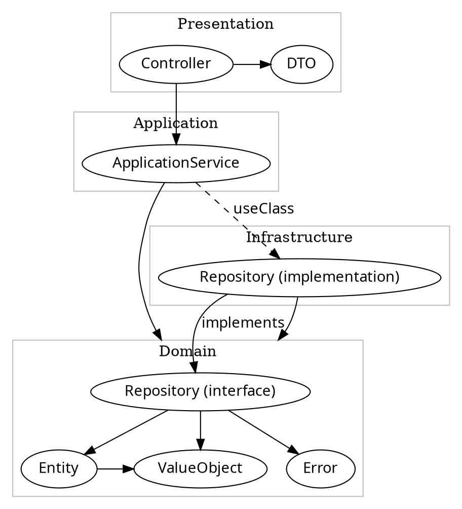

This document explains architecture of this project.

## Tiers

We split the project into four tiers: domain, infrastructure, application, and presentation. Dependencies among these tiers are as follows:

<!--

-->

### Domain

This tier represents the domain of target business. In this layer, we put the following codes:

- Value object (VO) like UserId
- Entity like User
- Domain Service
- Error, and
- Repository interface

### Infrastructure

This tier represents the infrastructure implementation of repository. In this layer, we put the Repository implementation.

Ideally, this tier can be replaced with similar implementation that supports another datastore, without updating other tiers.

If we use TypeORM as data mapper, the repository implementation can be [generated automatically](https://github.com/typeorm/typeorm/blob/0595d232178b622ccc5084cd039e94795e993e48/docs/active-record-data-mapper.md#what-is-the-data-mapper-pattern).

### Application

This tier represents use cases of each domain. Use cases are grouped per target domain and named ApplicationService.

All required operations are able to handle in this tier.

### Presentation

This tier provides RESTful interface to handle feature in the application tier. Note that this tier should not refer API in domain and infrastructure tier: only application services are visible to this tier.

This presentation tier also provides [OpenAPI definition and documentation](https://docs.nestjs.com/openapi).

## Test policy

We test the presentation layer first, then end-to-end (e2e) and infrastructure tier.
Here we'll explain why we chose this test policy:

Since this product is a RESTful app, it's important to test the presentation tier. It helps us keep the app behaviour as documented.  
The requirement surely includes behaviour in case of trouble. By injecting test doubles before running test, we can emulate various situations such as network timeout, service down during a transaction, etc.

It's also good to test with the e2e test in `test` directory. It helps us to ensure how [middlewares](https://docs.nestjs.com/middleware), [exception filters](https://docs.nestjs.com/exception-filters), [pipes](https://docs.nestjs.com/pipes) and [guards](https://docs.nestjs.com/guards) are working. It also helps us to test performance, security or other user concerns.  
One problem of e2e test is test-performance; Unlike unit test, it needs a complete environment like datastore. Better to use unit test as much as possible, to get faster feedback. Use e2e mainly to emulate and confirm users' operation.

Usually it's not so important to test the infrastructure tier, because data access framework is already tested. We need tests just to confirm our understanding of framework's feature.  
But in this product, we have two repository implementations: on-memory and mongo. To keep their behaviour same, we define expected behaviour as unit test, and run it with both implementation.

If domain logic has complex requirements, it's nice to have test in the application tier. It's also necessary if we have plan to implement other kinds of interface, such as GraphQL or HTML.
