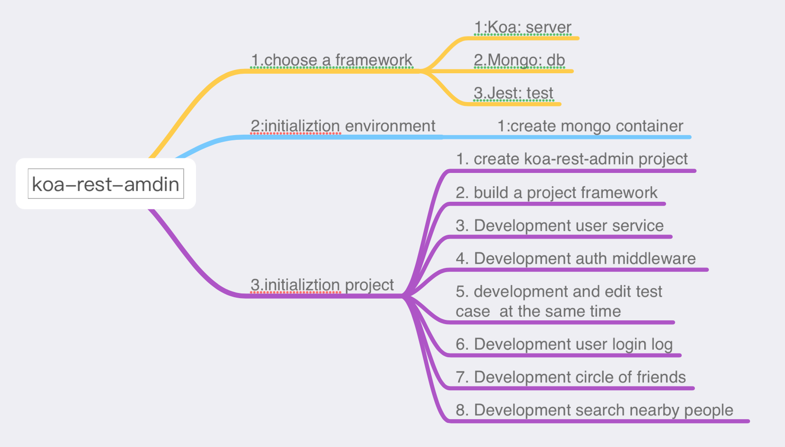
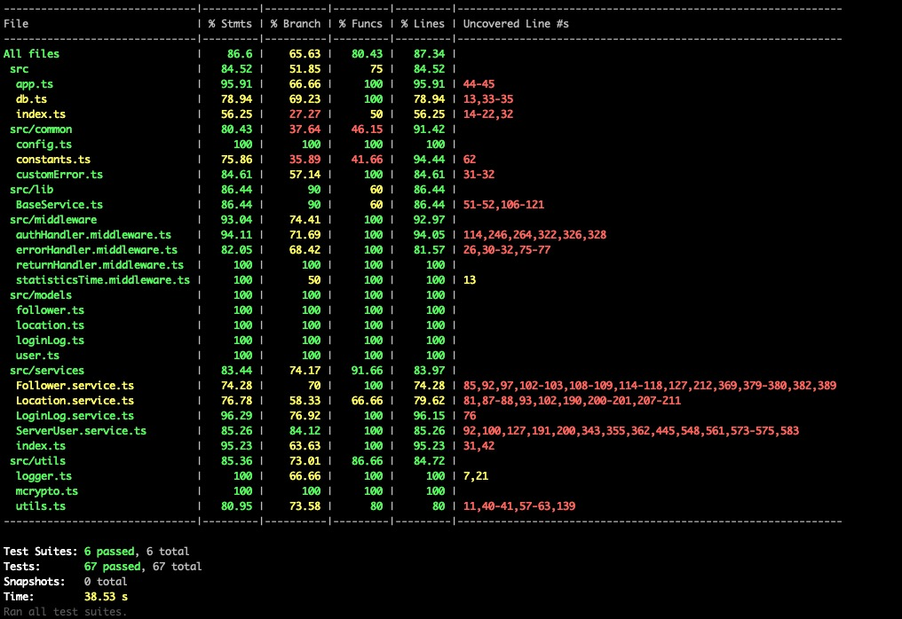

# kao-rest-admin


## About

This project uses [Koa](https://koa.bootcss.com/).
An open source lightweight web framework for building projcet，use RESTFUL to build services, MongoDB is used as a database.


## Getting Started

Getting up and running is as easy as 1, 2, 3, 4.

1. make sure you have [NodeJS](https://nodejs.org/), [npm](https://www.npmjs.com/), [docker](https://docs.docker.com/get-docker/) and [docker-compose](https://github.com/docker/compose/tags) installed.

2. Install your dependencies

   ```
   cd path/to/test-backend
   npm install
   ```
3. Create mongodb container, If you already have mongodb available locally, you can skip this step,
 but please modify the database related configuration that can be connected to MongoDB.

   ```
   cd path/to/test-backend/mongo-init/ && docker-compose up -d
   ```

4. Start your app

   ```
   npm start
   ```

## Develop brain drawing



## Documentation

The API document is under the `./doc/api` path. When running NPM RUN DEV, you can access EG: `http://127.0.0.1:7000/index.html` in the browser

## MongoDB configuration settings

If you use existing mongodb, please do the following configuration：

method one:

Please refer to the following configuration modification file `config/default.json` part of the DB `Database`:

   ```
   "Database": {
      "user": "root",
      "password": "dev.123",
      "host": "127.0.0.1",
      "dbname": "kra-test",
      "port": "28017"
   }
   ```
   explain
   ```
   "Database": {
      "user": "root",// db username
      "password": "dev.123",// db password
      "host": "127.0.0.1",// db host
      "dbname": "kra-test",// db name
      "port": "28017"// db port
   }
   ```

method tow:

Create a `.env` file in the project and directory, And refer to the `.env.example` files with the directory added the following configuration:

   ```
      APP_HOST=127.0.0.1
      APP_PORT=7002
      DB_NAME=kra-test
      DB_USER=root
      DB_PASSWORD=dev.123
      NODE_ENV=development
      AUTHENTICATION_SECRET=kdafjadaMrg9N1Hdso
   ```
   explain
   ```
      APP_HOST=127.0.0.1 // app host
      APP_PORT=7002 // app port
      DB_NAME=kra-test // db name
      DB_USER=root // db username
      DB_PASSWORD=dev.123 // db password
      NODE_ENV=development // node environment
      AUTHENTICATION_SECRET=kdafjadaMrg9N1Hdso // authorization secret
   ```

## Testing

Simply run `npm test` and all your tests in the `test/` directory will be run.

## Test coverage



## Log

The log file is stored under the  `./logs` folder

## Implement function

1. User registration and login notification
2. User login log to DB
3. User options in to log files
4. MongoDB init configuration
5. follower user
6. nearby user


## Mainly dependencies

  ```
   1. koa: web framework
   2. mongose: database operation tools
   3. typescript: ts
   5. jest, supertest: tests
   6. apidoc: generate services api documentation to html
   7. jsonwebtoken, bcryptjs: authorization
   8. dotenv: set environment params
   9. winston: logging
  ```