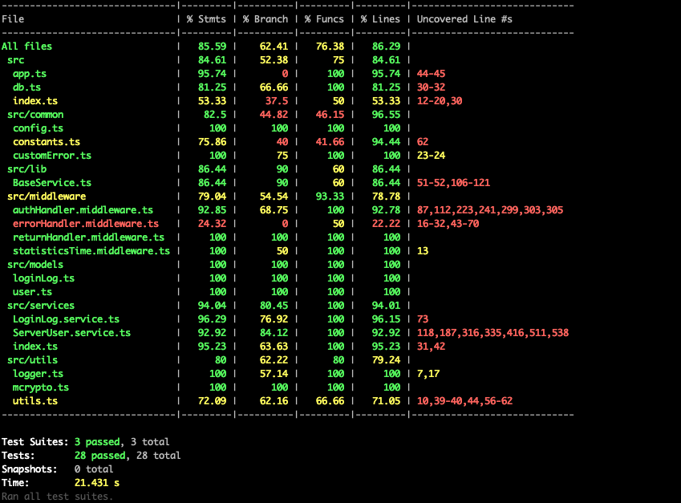

# kao-rest-admin


## About

This project uses [Koa](https://koa.bootcss.com/).
An open source lightweight web framework for building projcet，use RESTFUL to build services, MongoDB is used as a database.


## Getting Started

Getting up and running is as easy as 1, 2, 3.

1. make sure you have [NodeJS](https://nodejs.org/) and [npm](https://www.npmjs.com/) installed.

2. Install your dependencies

   ```
   cd path/to/koa-rest-admin
   npm install
   ```

3. Start your app

   ```
   npm start
   ```

## Develop brain drawing


## Documentation

The API document is under the `./doc/api` path. When running NPM RUN DEV, you can access EG: `http://127.0.0.1:7000/index.html` in the browser

## Testing

Simply run `npm test` and all your tests in the `test/` directory will be run.

## Test coverage



## Log

The log file is stored under the  `./logs` folder

## Implement function

1. User registration and login notification
2. User login log to DB
3. User options in to log files


## Mainly dependencies

  ```
   1. koa: web framework
   2. mongose: database operation tools
   3. typescript: ts
   5. jest, supertest: tests
   6. apidoc: generate services api documentation to html
   7. jsonwebtoken, bcryptjs: authorization
   8. dotenv: set environment params
   9. winston: logging
  ```