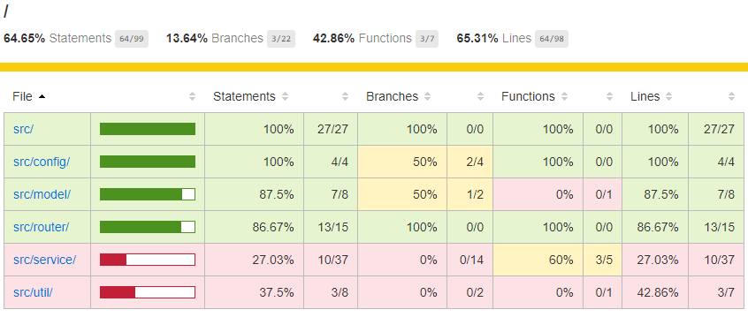
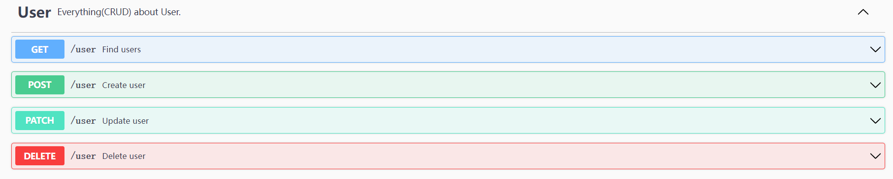

# Application test-backend

---
A backend service developed by Node.js language and providing RESTful APIs that 
can `get/create/update/delete` user data from a persistence database.
* [Original Requirement](Requirement.md)

## Table of Contents

* [Dependencies](#dependencies)
* [Project Structure](#project-structure)
* [Getting Started](#getting-started)
  * [Run Application](#run-application)
  * [Run Unit Test](#run-unit-test)
  * [Generate Test Coverage Report](#generate-test-coverage-report)
  * [Use EsLint for Code Inspection](#use-eslint-for-code-inspection)
* [Logging](#logging)
  * [General Logging](#general-logging)
  * [Request Logging](#request-logging)
* [API Documentation](#api-documentation)
* [TO-DO Items](#to-do-items)

---

## Dependencies

| Modules                 | Dependency         |
|-------------------------|--------------------|
| Runtime                 | `NodeJS`           |
| Database                | `MongoDB`          |
| Web Framework           | `express`          |
| Persistence Framework   | `mongoose`         |
| Logging Framework       | `pino`             |
| Logging Formatter(DEV)  | `pino-pretty`      |
| Documentation           | `swagger`          |
| Unit Test               | `mocha`<br/>`chai` |
| Unit Test Coverage(DEV) | `nyc`              |
| Code Inspection(DEV)    | `eslint`           |

---

## Project Structure

| Path              | Description                                                                                                                          |
|-------------------|--------------------------------------------------------------------------------------------------------------------------------------|
| `.env.template`   | The template to setup the `.env` file for the local environment.                                                                     |
| `.eslintrc.js`    | The ESLint configuration file for code scan.                                                                                         |
| `server.js`       | Entry point of **the project**. It starts the express application (defined in `src/app.js`) and listens the port(default: `3000`).   |
| `swagger.yaml`    | The swagger configuration for API documentation.                                                                                     |
| `src/`            | The directory for most of the application code.                                                                                      |
| `src/swagger.js`  | Define how the Swagger UI should be generated.                                                                                       |
| `src/init.js`     | Global variables and initialization code are defined here.                                                                           |
| `src/app.js`      | Entry point of **the express application**. [Middlewares](https://expressjs.com/en/guide/using-middleware.html) could be setup here. |
| `src/config/`     | The configuration files (e.g. database connection, logger configuration, etc.) should be placed here.                                |
| `src/controller/` | **Controllers** contain the logic for interacting with routers and business services.                                                |
| `src/model/`      | **Models** for DB tables or collections are defined here .                                                                           |
| `src/route/`      | The [**routers**](https://expressjs.com/en/4x/api.html#router) to router http paths to business layer should be placed here.         |
| `src/service/`    | **Services** are the reusable modules for the controllers to consume. (e.g. interacting with DB, etc.)                               |
| `src/util/`       | **Utils** are common logics of data operation. (e.g. object validation, data calculations, etc.)                                     |
| `test/`           | `npm test` will scan this directory for the test cases.                                                                              |


## Getting Started

### Run Application
1. Install [Node JS](https://nodejs.org/en/).
2. Prepare a local or remote [MongoDB](https://www.mongodb.com).
3. Go to the root directory of project, install the dependencies by command:

    ```
    $ npm i
    ```

4. Copy `.env.template` into a new file `.env`.
5. Edit `.env` to update the variables according to your environment. (Refer to the comments for variables in `.env.template` file)
6. Start the application by command.

     ```
     $ npm start
     ```

7. Play around with the [APIs](#api-documentation).

### Run Unit Test
Run all unit test cases by command:
```
npm run test
```
You may get the report summary in console like this:
```
Starting memory mongo DB.....


  Health Router Test
    GET /
      √ Welcome
    GET /_health
      √ OK

  User Router Test
Test server closed.
    #Create
      √ Create User - Success (56ms)
      √ Create User - Fail - Duplicate userId
      √ Create User - Fail - Without userId
    #Get
      √ Get User - Success - By ID
      √ Get User - Success - By Name
      √ Get User - Success - No Record
    #Update
      √ Update User - Success
      √ Update User - Success - No Matched
      √ Update User - Fail - Without ID
    #Delete
      √ Delete User - Success
      √ Delete User - Success - No matched
      √ Delete User - Fail - Without ID

Test server closed.

  14 passing (219ms)

Stopping memory mongo DB......
```

### Generate Test Coverage Report
Generate test coverage report by command:
```
npm run test-cover
```
The coverage report will be generated in folder `coverage` under the project root directory. 
You can check the report via both `coverage/coverage.json` in JSON format or `coverage/lcov-report` in HTML format.
A HTML report sample is like this:



### Use EsLint for Code Inspection
Scan code by command:
```
npm run eslint
```
And fix code issues by command:
```
npm run eslint-fix
```

---

## Logging

Logs should print to the stdout stream. This project uses [pino](https://getpino.io)
as the default logger which prints the logs in JSON format. You could pipe the
output to [pino-pretty](https://github.com/pinojs/pino-pretty) to transform the
logs into human-readable format during local development, just set the 
environment variable `LOG_PRETTY_PRINT=true` in `.env` file.

### General Logging

```js
require('./src/init');
const log = require('./src/config/logger-config');
log.info('Hello!');

const child = log.child({ ping: 'pong' });
child.info('Bye!');
```

```
# JSON Output
{"level":30,"time":1650187820753,"pid":8348,"hostname":"LAPTOP-5KGL2O9N","msg":"Hello!"}
{"level":30,"time":1650187875633,"pid":8348,"hostname":"LAPTOP-5KGL2O9N","ping":"pong","msg":"Bye!"}

# Pretty Output
[2022-04-17 17:32:37.448 +0800] INFO (18340 on LAPTOP-5KGL2O9N): Hello!
[2022-04-17 17:33:09.530 +0800] INFO (18340 on LAPTOP-5KGL2O9N): Bye!
    ping: "pong"
```

### Request Logging

There is a middleware `setReqLogger()` to initiate a logger under the `req.log`
property. The logger will try to get the `trace_id` from request header or generate a new UUID for it,
then bind it to logger for next loggings, it is a very useful practice for distributed tracing. 
The middleware will also print the inbound and outbound logs automatically.<br>
<br>
Here is a logging sample for `GET /user` request:
```
{"level":30,"time":1650188975249,"pid":16732,"hostname":"LAPTOP-5KGL2O9N","trace_id":"146e22a8-07fd-49eb-9e4f-67150eeffcfa","module":"_inbound","request":{"httpVersion":"1.1","method":"GET","pathname":"/user","headers":{"host":"localhost:3000","user-agent":"Mozilla/5.0 (Windows NT 10.0; WOW64) AppleWebKit/537.36 (KHTML, like Gecko) Chrome/100.0.4896.60 Safari/537.36","referer":"http://localhost:3000/swagger/"},"data":"{\"id\":\"7\",\"page\":\"1\",\"limit\":\"1\"}","remoteFamily":"IPv6","remoteAddress":"::1","remotePort":8918},"msg":"received request"}
{"level":30,"time":1650188975250,"pid":16732,"hostname":"LAPTOP-5KGL2O9N","trace_id":"146e22a8-07fd-49eb-9e4f-67150eeffcfa","module":"user-service","method":"getUser","msg":"retrieve user, query: {\"id\":\"7\",\"page\":\"1\",\"limit\":\"1\"}, option: {\"page\":\"1\",\"limit\":\"1\"}"}
{"level":30,"time":1650188975268,"pid":16732,"hostname":"LAPTOP-5KGL2O9N","trace_id":"146e22a8-07fd-49eb-9e4f-67150eeffcfa","module":"user-service","method":"getUser","msg":"got total 1 records."}
{"level":20,"time":1650188975269,"pid":16732,"hostname":"LAPTOP-5KGL2O9N","trace_id":"146e22a8-07fd-49eb-9e4f-67150eeffcfa","module":"user-service","method":"getUser","msg":"docs: [{\"_id\":\"6259901e993c3b8fecc79323\",\"id\":\"7\",\"name\":\"shawn\",\"dob\":\"1990.04.11\",\"address\":\"shanghai\",\"description\":\"a nodejs developer\",\"createdAt\":\"2022-04-15T15:32:46.562Z\",\"updatedAt\":\"2022-04-15T15:32:46.562Z\",\"__v\":0}]"}
{"level":30,"time":1650188975273,"pid":16732,"hostname":"LAPTOP-5KGL2O9N","trace_id":"146e22a8-07fd-49eb-9e4f-67150eeffcfa","module":"_outbound","response":{"time":25,"statusCode":200,"statusMessage":"OK","headers":{"contentType":"application/json; charset=utf-8","contentLength":240}},"msg":"sent response"}
```

---

## API Documentation

### GET `/`

#### Response

```
Welcome
```

### GET `/_health`

#### Response

```
OK
```

### GET / POST / PATCH / DELETE`/user`

The API documentation is defined in Swagger: http://localhost:3000/swagger


**NOTE** Ensure that the environment variable `SWAGGER_ENABLED` is set to `true`
to enable the Swagger documentation.

## TO-DO Items
- User auth(JWT)
- Supplement unit test cases to make coverage reach to 80%
