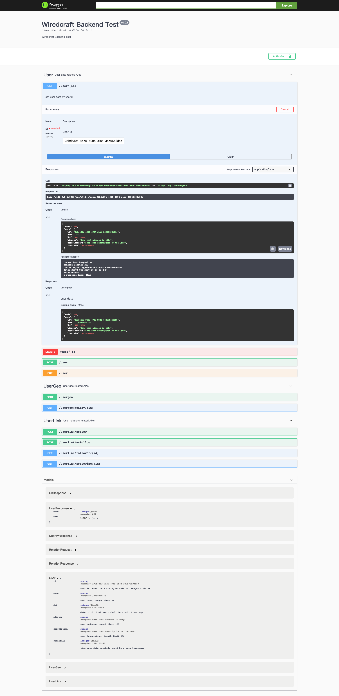
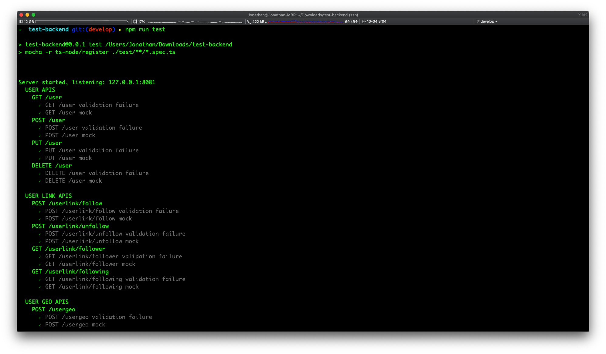
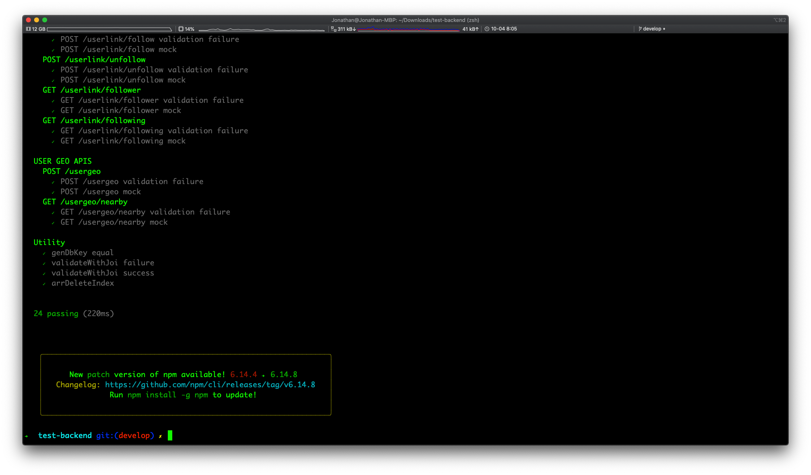
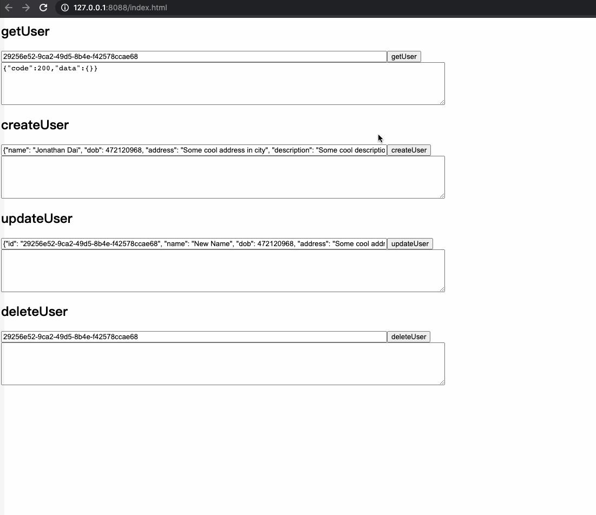

# Wiredcraft Back-end Developer Test

## What has been done

* RESTful API `get/create/update/delete` user data from redis db
* Swagger based API document, [sample](#koa2-swagger-ui)
* Winston based Log handling
* Redis based DB Storage, and Following/Follower & LBS functionality
* Mocha + Chai based unit test
* Swagger codegen based Frontend js code generating

## Tech stack

### Web

* koa2 based web server: [koa2](https://koajs.com/)
* joi based validation: [Doc](https://openbase.io/js/joi/documentation), [API](https://joi.dev/api)
* dotenv based config: [npm](https://www.npmjs.com/package/dotenv)
* jsdoc + swagger based API document: [jsdoc](https://jsdoc.app/), [swagger](https://swagger.io/docs/specification/about/)
    * generated swagger definition provided to: swagger.json downloading & koa2-swagger-ui
* koa2-swagger-ui based swagger Web UI: [npm](https://www.npmjs.com/package/koa2-swagger-ui), [sample](#koa2-swagger-ui)

### Database

* redis: [official](https://redis.io/)
    * Using data structure `sets` to save following/follower list: [Sets](https://redis.io/commands#set)
    * Using `Geo` api to handle LBS functionality: [Geo](https://redis.io/commands#geo)

### Test

* mocha, test framework: [npm](https://www.npmjs.com/package/mocha), [doc](https://mochajs.org/#getting-started)
* chai, assertion: [npm](https://www.npmjs.com/package/chai), [doc](https://www.chaijs.com/api/)
* ts-node, providing runtime ts codes compiling, make test codes written in typescript possible: [npm](https://www.npmjs.com/package/ts-node)

Screenshot of sample could be found: [here](#unit-test)

### Frontend code generating

* swagger codegen based frontend es6 codes generating: [github](https://github.com/swagger-api/swagger-codegen), [templates](https://github.com/swagger-api/swagger-codegen/tree/master/modules/swagger-codegen/src/main/resources/Javascript/es6), [supported langs](https://openapi-generator.tech/docs/generators/)
* browserify based browser js codes bundle generating: [npm](https://www.npmjs.com/package/browserify)
* babelify, providing es6 supports for browserify: [npm](https://www.npmjs.com/package/babelify)

Screenshot of sample could be found: [here](#browser-client-sample)

Sample codes in browser html:

```html
<script src="js/bundle.js"></script>
<script type="text/javascript">
    const api = new Wiredcraft.UserApi();

    const getUser = () => {
        api.getUser(document.getElementById("getUserInput").value, (err, data, response) => {
            document.getElementById("getUserDisplay").innerText = JSON.stringify(response.body);
        });
    };
</script>
```

### Runtime

* PM2, daemon process manager: [doc](https://pm2.keymetrics.io/)

## File structure

```
.
├── dist                        // js codes compiled from typescript codes
│   └── ...
├── doc                         // document dir
│   ├── images
│   │   └── ...
│   └── README.md
├── html
│   ├── js
│   │   ├── swagger             // frontend es6 js codes generated by swagger codegen
│   │   │   └── ...
│   │   └── bundle.js           // combined frontend js bundle file generated by browserify
│   └── index.html              // frontend sample html
├── log                         // log files
│   └── server.2020-10.log
├── node_modules
│   └── ...
├── src                         // source codes
│   ├── config                  // config utility
│   ├── controller              // controllers
│   ├── dao                     // dao
│   ├── database                // db utility, redis
│   ├── logger                  // logger utility
│   ├── model                   // models
│   ├── router                  // koa router
│   ├── server                  // koa server
│   ├── utility                 // other utility
│   └── index.ts                // server executable
├── test
│   ├── server                  // server unit test
│   └── utility                 // utility unit test
├── .env.development            // development env config file
├── .env.production             // production env config file
├── .gitignore
├── package.json
├── README.md
├── tsconfig.json               // typescript compiling config
├── tslint.json                 // tslint config
└── yarn.lock
```

## How to install

* Install git: [Getting Started - Installing Git](https://git-scm.com/book/en/v2/Getting-Started-Installing-Git)
* Install node.js: [Installing Node.js via package manager](https://nodejs.org/en/download/package-manager/)

```
$ git clone git@github.com:agreatfool/test-backend.git
$ npm install yarn -g
$ cd test-backend
$ yarn install
```

## How to run
### Config
Config items could be found: `project_root/.env.development` & `project_root/.env.production`.

If server app started with `NODE_ENV=production`, file `.env.production` would be loaded, otherwise `.env.development` would be loaded.

Config items:

```
# LOG
LOG_LEVEL=debug         # log level
LOG_CONSOLE=false       # whether output logs in console

# WEB
WEB_HOST=127.0.0.1      # web server host
WEB_PORT=8081           # web server port

# DB
REDIS_HOST=127.0.0.1    # redis host
REDIS_PORT=6379         # redis port
REDIS_DB_NUM=0          # redis db

# GEO
SEARCH_RADIUS=5         # LBS search radius
SEARCH_UNIT=km          # LBS search unit
```

### Commands

```
$ npm run build         # compile typescript codes to js, with -w option
$ npm run dev           # start web server with nodemon, automatically restart app when code changed
$ npm run test          # run unit test cases in "test" dir
$ npm start             # start web server with PM2 cluster mode, 4 process; "/swagger" disabled in production env
$ npm run stop          # stop web server processes managed by PM2
$ npm run gen-client    # generate client es6 codes & merge them into bundle.js with browserify, "/swagger" enabled web server required
$ npm run client        # start a static web server serving "html" dir
```

### About logs
Log files are created with name "server.YYYY-MM.log". File would be rotated with time: "14 days" or file size: "30M".

Log format is "JSON". Logs are separated by line.

Structure of each line is:

```typescript
export interface LogInfo {
  app: string; // server
  module: string; // UserController
  action: string; // getUser
  data: any;

  [key: string]: any;
}
```

Currently, Log file mainly contains:

```
// web server api consuming:

{"level":"info","time":"2020-10-02 20:51:26","app":"Server","module":"Koa","action":"middleware","data":"GET /api/v0.0.1/user/29256e52-9ca2-49d5-8b4e-f42578ccae68 - 200 - 6ms"}

// web server response:

{"level":"debug","time":"2020-10-02 21:14:35","app":"Server","module":"UserController","action":"createUser","data":"{ id: 'be5eb968-8a85-427f-a3a9-c81395c974c1',\n  name: 'Jonathan Dai',\n  dob: 472120968,\n  address: 'Some cool address in city',\n  description: 'Some cool description of the user',\n  createdAt: 1579120968 }"}
``` 

## Appendix
### koa2-swagger-ui


### unit-test



### browser-client-sample

