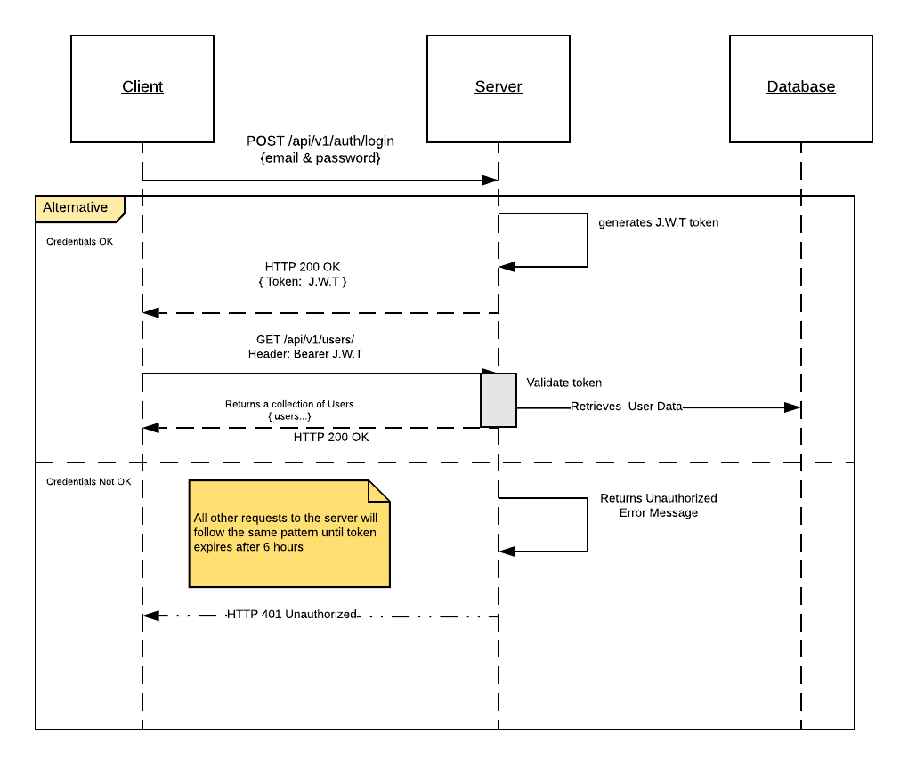

# WiredCraft Back-end Developer Test

## Table of Content
* [Architecture](#architecture)
  * [Technical Stack](#tech-stack)
* [Design](#design)
  * [Authentication](#authentication)
    * [UML Diagram](#uml-sequence-diagram)
    * [Authentication Strategy](authentication-strategy)
  * [Logging](#logging)
  * [Testing](#testing)
* [Setup](#setup)
* [Deployment](#deployment)
* [Improvements](improvements)

## Architecture

### Technical Stack

- Framework -> Loopback 4
  * I choose loopback 4 because of speed and it's extensibility. Loopback's codebase is well structured and saves you the headache of thinking about that. Also, for personal preference,
  I lean towards strongly typed languages due to my experience with Go and Java.
- Testing -> Mocha
- Config -> dovenv
- Database -> MongoDB
- Deployment -> Docker

## Design

### Authentication

#### UML Sequence Diagram

Below is the Sequence diagram for the user login flow. Assuming the user has already been created. 

#### Authentication Strategy

## Improvements

There are quiet a few things that I think can be implemented to improve this solution:

* User Sessions

* Revoking tokens when user is deleted.

* Adding Rate limiter to strengthen security
