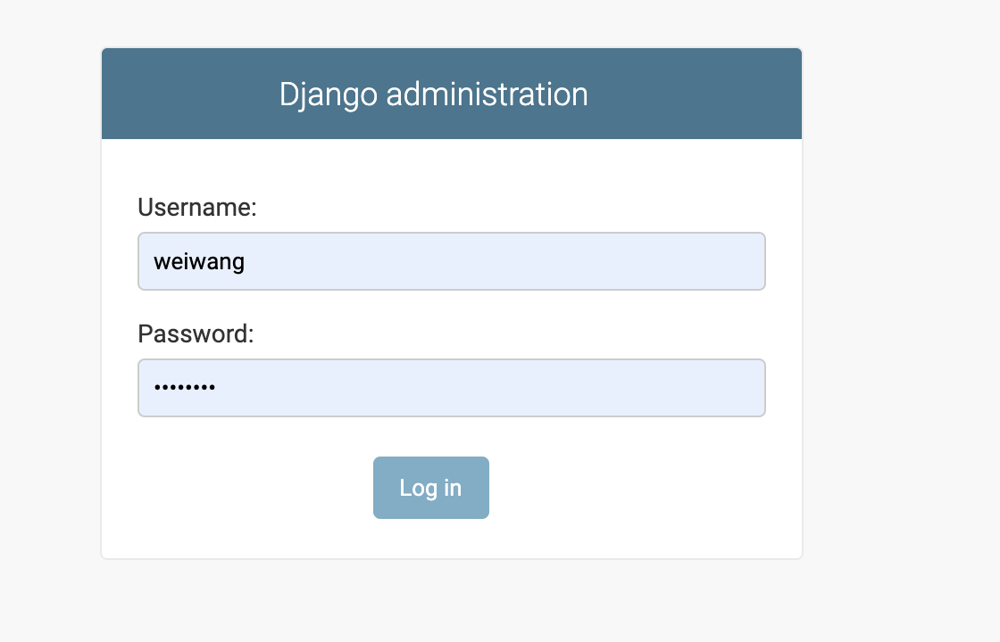
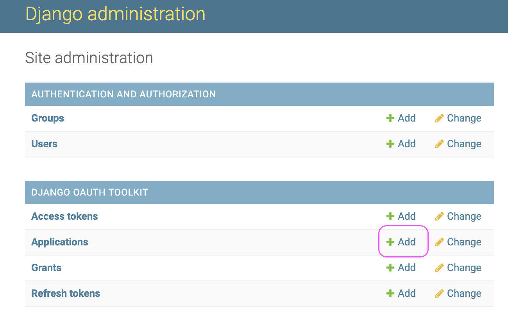

## OAuth feature instructions

### Creating superuser
Create superusers using the createsuperuser command:
```shell
python manage.py createsuperuser
```
You will be prompted for input a username and password. After you enter one, the user will be created immediately. 

### Logging to admin site
Visit http://localhost:8000/admin/ to access of Django administration site.


### Register an application
After logging in to Django administration site, you will see `DJANGO OAUTH TOOLKIT` menu rest on the left side of the page.
Click the Add button which highlighted by the purple circle in the below picture.

Application choose follow type and save.
```
Name: just a name of your choice
Client Type: confidential
Authorization Grant Type: Resource owner password-based
```

### Ready to get a token
At this point we’re ready to request an access_token. Open your shell
```shell
curl -X POST -d "grant_type=password&username=<user_name>&password=<password>" -u"<client_id>:<client_secret>" http://localhost:8000/o/token/
```
The `user_name` and `password` are the credential of the users registered in your Authorization Server, we can use superuser credentials just created for simplicity.
Response should be something like:
```json
    "access_token": "<your_access_token>",
    "token_type": "Bearer",
    "expires_in": 36000,
    "refresh_token": "<your_refresh_token>",
    "scope": "read write groups"
}
```

### Using OAuth2 method to access API
Please beware a prerequisite that we should tell Django REST Framework to use the new authentication backend.

Add/modify the following lines in project `settings.py` module
```python
    'DEFAULT_AUTHENTICATION_CLASSES': [
        'oauth2_provider.contrib.rest_framework.OAuth2Authentication',
    ],
```

Then grab the access_token and start using our new OAuth2 API:
```shell
# Retrieve users
curl -H "Authorization: Bearer <your_access_token>" http://localhost:8000/appusers/
```
without access token provided would prompt
```shell
{
  "detail": "Authentication credentials were not provided."
}
```