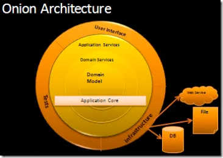
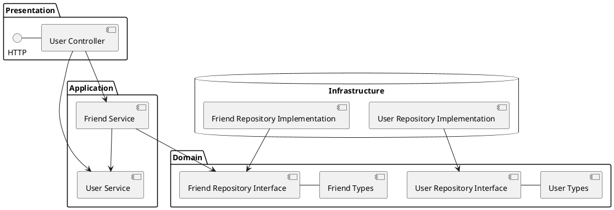
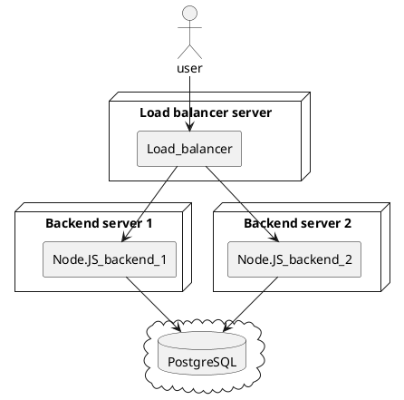

# Architecture documentation

## Components

This application makes use of the onion architecture design, which puts an emphasis on maintenance and abstraction.
It consists out of multiple layers, such as the domain, application, infrastructure and presentation. These layers are represented as folders in this project (https://jeffreypalermo.com/2008/07/the-onion-architecture-part-1/)

This design pattern allows access from the outer layers, different presentation and interface implementations, to the application core. Further on enables it easier testing scenarios.

 
(Ref: https://jeffreypalermo.com/2008/07/the-onion-architecture-part-1/)

### Diagram

The component architecture is visible in the following diagram.

- Presentation layer
    - Implements the REST API and accesses the user and friend service
    - The user controller implements both, user and friends, as both are related to the user domain
- Application layer
    - Builds an abstraction from the presentation
    - Can do transformation or call other services
- Domain layer
    - Represents the data being handled by the application
    - Defines interfaces for data retrieval
- Infrastructure layer
    - Implements domain layer interfaces
    - Can be of any type, for example database, remote call (HTTP), in-memory

## Technology

### NestJS

This project makes heavy use of NestJS as it allows to rapidly build applications in a maintainable manner. It enables dependency injection,

### PostgreSQL

The assignment asked for a NoSQL database but this assignment uses PostgreSQL. 
PostgreSQL allows to force a certain data structure on database level, not just application level. 
This helps prevent data issues where application data structure has changed but was not forced through to the database.

## Deployment

The deployment depends on the scale of the application. 
It is assumed that the application is deployed across multiple servers to allow for load handling and fall back. How the database is hosted is not a concern of this project, it is an SaaS in this project.

